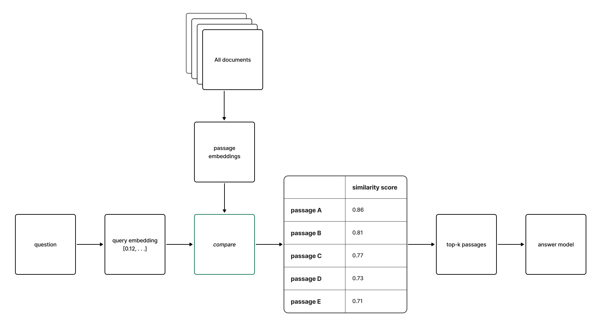
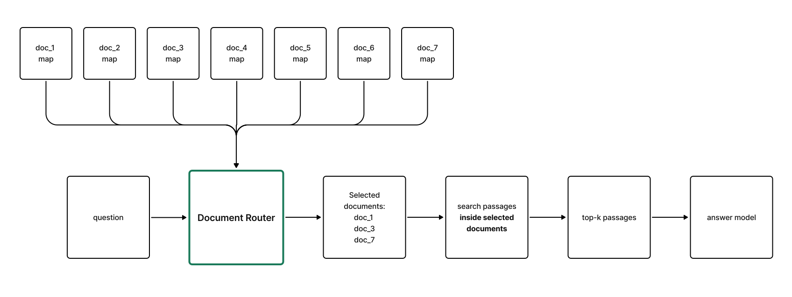
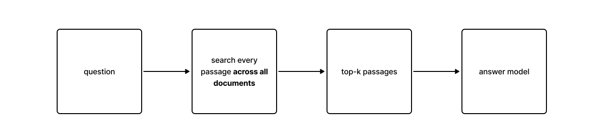
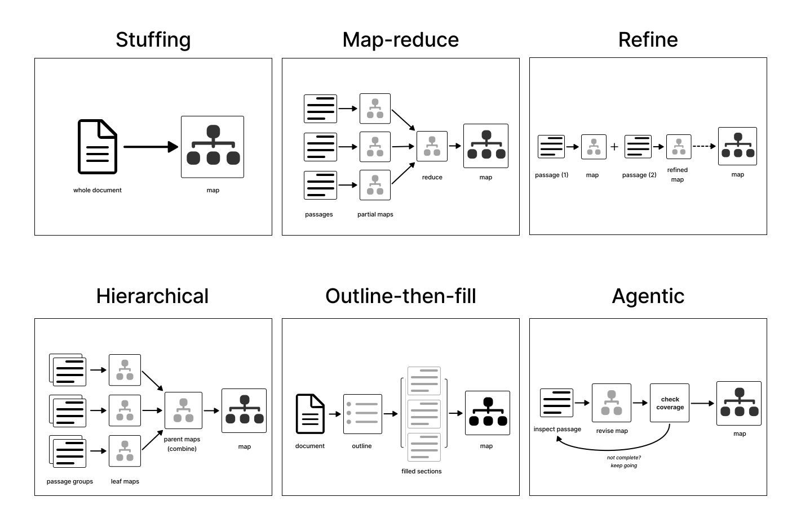

# Long Document Indexing

Companion repository for [Long Document Indexing for RAG](ARTICLE_URL).

This repository implements and evaluates **document maps** as a document-routing layer for retrieval-augmented generation (RAG) over long, multi-document collections.

The reference benchmark uses Multi-LexSum legal case files and compares a standard dense-retrieval baseline with six ways of constructing a document map. All systems use the same passage retriever and answer model; the main experimental difference is whether a document-level routing step narrows the search before passage retrieval.

The central question is:

> Can a structured representation of each document help a RAG system route complex questions to the documents that contain the required evidence?

The repository includes:

- seven retrieval systems: one flat baseline and six document-map strategies;
- a fixed 60-question benchmark over 20 Multi-LexSum case files;
- deterministic local evaluation and reporting;
- optional Microsoft Foundry evaluation workflows;
- local smoke fixtures that run without Azure credentials or paid model calls.

## How It Works

### The retrieval problem

A standard RAG system typically splits documents into passages, embeds them, and retrieves the passages most similar to a question:



For long, multi-document collections, a question may depend on evidence spread across several documents. In a legal case file, for example, the complaint, a later court order, and a settlement may each contain a different part of the answer.

This repository separates retrieval into two stages:

1. **Document routing** — decide which documents are likely to contain the required evidence.
2. **Passage retrieval** — search the original passages inside those documents.

The experiment changes the first stage while keeping the second stage fixed.

### Document maps

A **document map** is a structured representation of a source document created during ingestion. It provides a compact view of the document's contents while keeping its entries linked to the original passages.

Each map contains:

- an overview of the document;
- entries for important facts, events, claims, decisions, or other topics;
- references from those entries back to the source passages.

The shared data model is defined in [`maps.py`](src/long_document_indexing/domain/maps.py). A map entry has a `kind`, `label`, `summary`, and `source_references`, with optional attributes and child entries.

A generated entry looks like this:

```yaml
document_id: CJ-AL-0007:doc_0001
construction_method: map_reduce
entry:
  id: E1_case
  kind: case_summary
  label: Case overview & parties
  summary: >
    Named plaintiffs (Sharnalle Mitchell; Lorenzo Brown; Courtney Tubbs;
    Tito Williams) sued the City of Montgomery; complaint filed 03/18/2014
    (Case No. 2:14-cv-00186-MEF-CSC) seeking declaratory, injunctive,
    and monetary relief.
  source_references:
    - document_id: CJ-AL-0007:doc_0001
      segment_ids: [CJ-AL-0007:doc_0001:seg_0001]
    - document_id: CJ-AL-0007:doc_0001
      segment_ids: [CJ-AL-0007:doc_0001:seg_0008]
```

### Indexing

Every map-based system creates two separate artifacts from the same source passages:

1. A **document map** summarizes what each document contains. The router reads these maps to decide which documents to search.
2. A **dense passage index** stores embeddings of the original passages. After routing, the retriever searches this index within the selected documents.

The dense index is not built from the document map. Both are created during indexing from the original source material and serve different stages of the query flow.

The flat-vector baseline creates only the dense passage index.

### Querying

For a map-based system:



The baseline skips document routing:



Both paths use the same dense-retrieval backend and answer model.

The shared map query flow is implemented in [`map_base.py`](src/long_document_indexing/systems/map_base.py), and the baseline is implemented in [`flat_vector.py`](src/long_document_indexing/systems/flat_vector.py).

For a step-by-step code-level view of this lifecycle, see the [Repository Walkthrough](docs/repo-walkthrough.md).

## Systems Compared

The six map systems differ only in how they construct the document map.



| System | What it does |
| --- | --- |
| `flat_vector` | Baseline. Searches raw passages across the whole case without document maps or routing. |
| `stuffing` | Sends the whole document to the map builder in one call when it fits the configured input limit. |
| `map_reduce` | Maps document parts independently, then recursively combines the partial maps. |
| `refine` | Reads passages in order and updates one evolving map after each passage. |
| `hierarchical_map` | Builds maps for small groups of neighboring passages, then combines them through several levels. |
| `outline_then_fill` | Creates a document outline first, fills its sections from source passages, then assembles the final map. |
| `agentic_map` | Uses a bounded inspect-and-revise loop to identify and fill missing passage coverage. |

See the [system implementations](src/long_document_indexing/systems/). Per-system settings are stored in the [per-system configurations](configs/systems/).

## Benchmark

The reference comparison uses:

- **20 Multi-LexSum legal case files**;
- **60 hand-curated questions**;
- 20 single-document questions;
- 20 multi-document questions;
- 20 chained multi-document questions;
- **7 retrieval systems**, producing 420 system-question runs.

Each question contains:

- an expected answer;
- the document IDs required to answer it;
- the relevant passage IDs;
- supporting evidence quotes.

The fixed question set is stored in [`rag-qa-extended.jsonl`](benchmarks/multilexsum/rag-qa-extended.jsonl). The [`case manifest`](benchmarks/multilexsum/rag-qa-extended-case-manifest.json) records the selected cases and dataset revision.

The benchmark evaluates two retrieval stages separately:

- **document routing** — whether the required documents were selected;
- **passage retrieval** — whether the labeled evidence was recovered after document selection.

It also records map validity and completion, citation checks, answer-reference overlap, runtime, and model usage.

For exact metric definitions, see the [Metrics Reference](docs/metrics.md).

The aggregate results reported in the companion article are preserved in the
[versioned benchmark results](results/foundry-multilexsum-legal-rag-qa-role-separated-extended/README.md).
Start with the [readable benchmark report](results/foundry-multilexsum-legal-rag-qa-role-separated-extended/results.md)
for the system scorecard, metric tables, and usage summary.

## Quick Start

The local smoke benchmark exercises the complete repository workflow without Azure credentials or paid model calls.

Requirements:

- Python 3.12 or 3.13;
- [`uv`](https://docs.astral.sh/uv/).

Install the development dependencies:

```bash
uv sync --python 3.13 --extra dev
```

Run all seven systems on the deterministic local fixture:

```bash
uv run --python 3.13 --no-editable \
  --reinstall-package long-document-indexing \
  ldi run --config configs/experiments/advanced-systems-smoke.yaml
```

The smoke configuration uses fake model clients. It is intended to verify the software workflow, not to measure retrieval quality.

`ldi run` executes the complete experiment lifecycle:

```text
prepare -> index -> query -> evaluate -> report
```

Outputs are written to:

```text
artifacts/advanced-systems-smoke/
```

Run the test suite with:

```bash
uv run --python 3.13 --extra dev pytest
```

## Run the Multi-LexSum Benchmark

The reference legal experiment uses Azure OpenAI deployments configured through Microsoft Foundry.

Calls to those deployments can incur Azure usage charges. A two-case Azure smoke configuration is included so that the setup can be checked before running the complete 20-case benchmark.

### 1. Configure the model deployments

The experiment separates five model roles:

| Role | Environment variable | Model used in the reference run |
| --- | --- | --- |
| Map builder | `FOUNDRY_GENERATOR_DEPLOYMENT` | GPT-5 mini |
| Document router | `FOUNDRY_ROUTER_MODEL` | GPT-5 mini |
| Answer writer | `FOUNDRY_ANSWER_MODEL` | GPT-5 mini |
| Evaluation judge | `FOUNDRY_JUDGE_MODEL` | GPT-5 |
| Passage embeddings | `FOUNDRY_EMBEDDING_MODEL` | text-embedding-3-large |

The role variables may point to the same deployment.

Create the local environment file:

```bash
cp .env.example .env
```

Fill in `.env` with the required endpoint, API key, deployment names, and Foundry project endpoint. Do not commit `.env`.

Install the optional dependencies:

```bash
uv sync --python 3.13 --extra dev --extra foundry --extra multilexsum
```

API-key inference does not require Azure CLI login. Publishing evaluation runs to the Foundry portal uses your Azure identity and may require `az login`.

### 2. Run the Azure smoke benchmark

```bash
uv run --python 3.13 --extra foundry --extra multilexsum \
  --no-editable --reinstall-package long-document-indexing \
  ldi run \
  --config configs/experiments/foundry-multilexsum-legal-rag-qa-role-separated-smoke.yaml
```

Use this run to verify the endpoint, deployments, quotas, structured outputs, embeddings, and report generation.

### 3. Preview the full benchmark

Before making model calls for the extended run:

```bash
uv run --python 3.13 --extra foundry --extra multilexsum \
  --no-editable --reinstall-package long-document-indexing \
  ldi run \
  --config configs/experiments/foundry-multilexsum-legal-rag-qa-role-separated-extended.yaml \
  --dry-run-budget
```

### 4. Run the 20-case comparison

```bash
uv run --python 3.13 --extra foundry --extra multilexsum \
  --no-editable --reinstall-package long-document-indexing \
  ldi run \
  --config configs/experiments/foundry-multilexsum-legal-rag-qa-role-separated-extended.yaml
```

The run writes checkpoints as it progresses. Repeating the command reuses valid indexes and successful answers and retries missing or failed work.

If an existing artifact no longer matches the current inputs, the command stops rather than silently replacing it. Use `--allow-stale-recompute` when replacing stale work is intentional. `--force` rebuilds everything.

The configured model-call and token limits are safety ceilings, not expected usage estimates.

## Evaluation

`ldi run` automatically computes the configured local metrics after query execution and then writes the experiment report.

The local evaluation includes:

- document-routing metrics;
- passage-retrieval metrics;
- map validity and completion checks;
- citation metrics;
- lexical answer-reference comparisons;
- runtime and usage metrics.

The [local metric implementations](src/long_document_indexing/evaluation/local/) are documented in the [Metrics Reference](docs/metrics.md).

### Optional Foundry evaluation

The repository also supports Foundry evaluators over the saved benchmark outputs. These are separate from the main `ldi run` lifecycle and do not rerun indexing, retrieval, or answer generation.

Preview the managed evaluation:

```bash
uv run --python 3.13 --extra foundry --extra multilexsum \
  --no-editable --reinstall-package long-document-indexing \
  ldi evaluate-foundry-managed \
  --config configs/experiments/foundry-multilexsum-legal-rag-qa-role-separated-extended.yaml \
  --dry-run
```

Remove `--dry-run` to execute it.

The repository can also publish the deterministic benchmark metrics as comparable system-by-system runs in Foundry:

```bash
uv run --python 3.13 --extra foundry --extra multilexsum \
  --no-editable --reinstall-package long-document-indexing \
  ldi publish-foundry-evals \
  --config configs/experiments/foundry-multilexsum-legal-rag-qa-role-separated-extended.yaml \
  --evaluation-name ldi-multilexsum-legal-rag-qa-extended \
  --run-name rag-qa-role-separated-extended-visible \
  --dry-run
```

Remove `--dry-run` to publish.

## Outputs

Each experiment writes its generated artifacts under:

```text
artifacts/<experiment-id>/
```

The main outputs are:

- `indexes/` — dense indexes, document maps, and index metadata;
- `runs/` — one normalized run record per system and question;
- `evaluations/` — local metrics and optional Foundry evaluation artifacts;
- `report/` — Markdown, CSV, and JSON experiment summaries.

Start with `report/results.md` for the generated experiment report. To trace a particular question through the system, inspect the corresponding record in `runs/<system>.jsonl`.

The [versioned benchmark results](results/foundry-multilexsum-legal-rag-qa-role-separated-extended/README.md)
provide a compact, committed snapshot of the reference experiment's aggregate reports.
This snapshot is separate from the generated local artifacts above.

A more detailed description of the artifact structure is available in the [Repository Walkthrough](docs/repo-walkthrough.md).

## Repository Guide

| Path | What it contains |
| --- | --- |
| `benchmarks/` | Versioned benchmark questions, labels, smoke data, and case manifests. |
| `configs/experiments/` | Complete experiment configurations. |
| `configs/systems/` | Per-system retrieval and map-construction settings. |
| `prompts/` | Prompts used for map construction, routing, and answering. |
| `src/long_document_indexing/datasets/` | Dataset adapters and validation. |
| `src/long_document_indexing/systems/` | Retrieval systems and map-construction strategies. |
| `src/long_document_indexing/retrieval/` | Dense and local retrieval backends. |
| `src/long_document_indexing/evaluation/` | Local metrics and Foundry integration. |
| `src/long_document_indexing/reporting.py` | Markdown, CSV, and JSON report generation. |
| `tests/` | Unit and integration tests. |

Additional documentation:

- [Repository Walkthrough](docs/repo-walkthrough.md) — follows an experiment through the codebase from configuration to reporting.
- [Metrics Reference](docs/metrics.md) — exact definitions and interpretation of the evaluation metrics.
- [Multi-LexSum benchmark notes](benchmarks/multilexsum/README.md) — dataset adapter, benchmark assets, and licensing notes.

## Extending the Benchmark

The repository uses shared corpus, benchmark, index, and run-record structures so that new components can reuse the existing execution and evaluation pipeline.

To add a dataset, implement a loader that returns the shared corpus and benchmark objects and register it in [`datasets/registry.py`](src/long_document_indexing/datasets/registry.py).

To add a retrieval system, implement the `RagSystem` interface and register it in [`systems/registry.py`](src/long_document_indexing/systems/registry.py).

See the [Repository Walkthrough](docs/repo-walkthrough.md) for the relevant interfaces and execution flow.

## Scope

This repository is an experimental benchmark for comparing retrieval strategies,
not a production legal research application.
